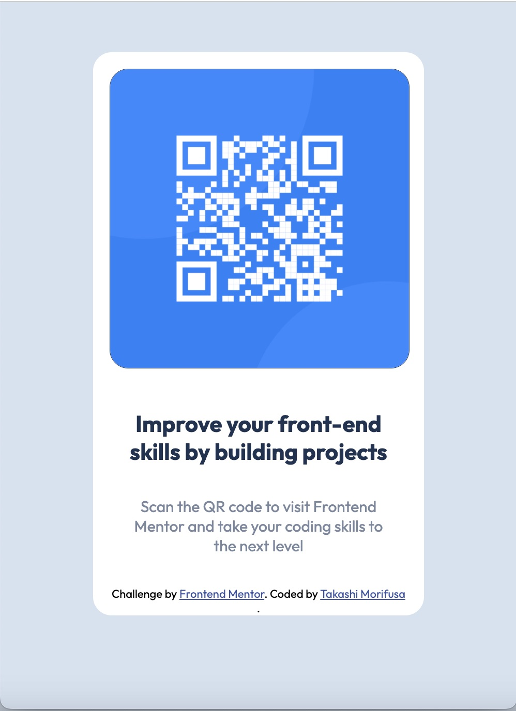
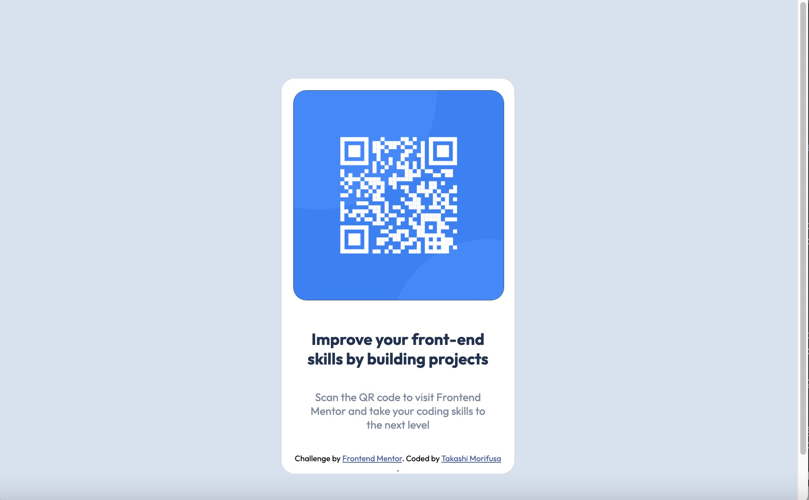

# Frontend Mentor - QR code component solution

This is a solution to the [QR code component challenge on Frontend Mentor](https://www.frontendmentor.io/challenges/qr-code-component-iux_sIO_H). Frontend Mentor challenges help you improve your coding skills by building realistic projects. 

## Table of contents

- [Overview](#overview)
  - [Screenshot](#screenshot)
  - [Links](#links)
- [My process](#my-process)
  - [Built with](#built-with)
  - [What I learned](#what-i-learned)
  - [Continued development](#continued-development)
  - [Useful resources](#useful-resources)
- [Author](#author)
- [Acknowledgments](#acknowledgments)

**Note: Delete this note and update the table of contents based on what sections you keep.**

## Overview
This is a first project to design CSS based on the designed image files.
The challenge is to understand how to ude Google font, padding and margin to looks closed to the original design files for web and mobile.

### Screenshot

### Links
- Live Site URL: [Live Site on netlify.com](https://thunderous-chaja-4de69c.netlify.app/)

## My process
First of all, upload original web and mobile design file onto Figma and trace the design.
Identify size of corner radius, font, and margin.
Second, define CSS class for each property.
At last, fine tune using Browser Web tool to try & error to fit and finish.

### Built with
- Semantic HTML5 markup
- CSS custom properties
- Mobile-first workflow

### What I learned
How to apply corner radius to the placed images.
How margin, padding works.
How to use Google font.
How to use responsive design.

### Continued development

I'm still learning when to use margin and when to use padding to tthe design. Also, for responsive design, I'm still not figure out when to use hard corded font side or relative font size.

Since this is one column layout, it's simple. I'd like to try more complex multiple colummn layout with header and footer design.

### Useful resources
https://www.w3schools.com/
https://developer.mozilla.org/
https://stackoverflow.com/

## Author

- Website - [Takashi Morifusa](https://www.linkedin.com/in/morifusa/)
- Frontend Mentor - [@morifusa](https://www.frontendmentor.io/profile/morifusa)
- Twitter - [@omorifusa](https://www.twitter.com/morifusa)

